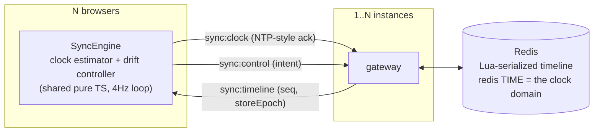

# 🍿 Mustard Watch Party

Watch YouTube together, **measurably in sync**. A watch party is distributed
clock synchronization under variable network conditions — this repo treats it
that way: a server-authoritative timeline, NTP-style clock discipline, a
measured drift controller, and a harness that proves the numbers instead of
claiming them.


## The numbers (measured, not claimed)

Same deterministic 3-browser scenario, same hardware, before → after the
sync overhaul. Every figure in this table traces to a committed run under
[`docs/measurements/`](docs/measurements/) with SHA + hardware provenance.
(Elsewhere in the docs, figures measured locally but not committed are
tagged **[lab]** — see the provenance convention in
[SYNC_DESIGN.md](docs/SYNC_DESIGN.md).)

| scenario (one-way impairment) | baseline | reactive | **predictive servo (default)** |
|---|---|---|---|
| S0 — clean loopback | 363ms / 255.3s | 31 / 83ms | **16 / 49ms** |
| S2 — +150ms each way (~300ms RTT) | total failure | 25 / 139ms | **19 / 48ms** |
| S3 — 50±30ms jitter each way | aborted† | 68 / 118ms | **23 / 79ms** |
| S5 — 25ms + 5% packet loss | aborted† | 60 / 97ms | **11 / 29ms** |
| S6 — asymmetric 120/20ms | aborted† | 47 / 120ms | **10 / 86ms** |

*Steady-state pairwise drift P50 / P95, 3 real Chrome clients, deterministic
240s scenario, identical hardware. "Total failure" = the shipped engine's
followers never started playing at all, recorded as a committed exhibit run.
Runs: [`docs/measurements/`](docs/measurements/) — baseline, after
(reactive), servo (predictive).*

*† The baseline engine failed the harness player-health gate on both attempts
under S3/S5/S6 — same signature as S2, followers never started — so the run
aborted and no artifact exists to cite. Only S0 and S2 have committed
baseline directories. These cells say "aborted" rather than "total failure"
because an observation that produced no artifact is not a measurement, and
this table cites only what you can open.*

**Validated against the signal, not the clock.** Player-API drift is the
instrument grading itself, so a separate track measures the *physical* output:
three browsers play a click track, an AudioWorklet timestamps each burst on the
audio thread, and the same click is differenced across clients. Truth: **P50
13.2ms / P95 64.0ms** where the player API claimed 7.9 / 19.0ms — the API-based
numbers are **optimistic by ~45ms at P95**, and that gap is now measured rather
than assumed ([docs/AUDIO_TRUTH.md](docs/AUDIO_TRUTH.md)).

Clock-sync theory, validated in vivo: under the asymmetric path (S6) the
clients' own offset estimates carry a **+50.5ms** bias against a **+50.0ms**
prediction (asym/2), with the symmetric control at 0.0ms — the irreducible
NTP-family floor, measured rather than hidden.


The baseline wasn't just slow — **the shipped sync worked only on
localhost**: control events were silently dropped on any real network, a
host seek permanently desynced the room by the full seek distance (255s,
measured), and no correction mechanism existed
([baseline findings](docs/measurements/baseline/README.md)).

Protocol-level, on the production multi-instance plane: 100 clients in one
room hold P95 149ms (P50 70ms); a 10-cell load sweep (10→250 clients × 1/3
instances) finds **no SLO breach up to 250 clients in one room on either
topology**, with zero seq gaps or reorders on every cell. An earlier sweep
had measured a one-instance event-loop-lag knee at 250 (130ms); a controlled
re-run did not reproduce it (42ms), so the knee is above 250 and honestly
*unlocated* — both runs are committed
([scaling results](docs/SCALING.md#5-load-characterization)).

## How it works



- **The room's state is a projectable function**, not a scalar:
  `mediaTimeAt(now) = mediaTime + elapsed·rate`, restamped server-side per
  control event with a monotone `seq`. Clients drop stale `(storeEpoch, seq)`.
- **Wait-for-broadcast control**: the button-presser converges from the same
  broadcast as everyone else — echo storms are structurally impossible.
- **Clock discipline**: NTP-style offset over a Socket.IO ack, median-of-
  best-RTT filtering, slew-not-step; validated by bot fleets with injected
  ±1s offsets and ±80ppm skews, recovered to a θ-error P95 of ~3ms
  (2.7–6.9ms across the committed 10→250-client sweep).
- **Predictive clock discipline** (default): a PI servo with an RLS-learned
  feed-forward skew term commands a continuous playback rate that cancels
  drift *before* it accumulates. It is engaged per video by a runtime probe;
  where the player refuses fractional rates the engine falls back to a
  SEEK-first controller whose corrective seeks target `projected + lead`,
  with the lead *learned* from each seek's settle residual.
- **Multi-instance**: room timelines live in Redis behind one Lua script per
  mutation (Redis's single-threaded execution is the serializer — no locks),
  with `redis TIME` as the single clock domain (4ms spread measured across
  live instances by `verify-m6.ts`; console-gated, not a committed run). Kill -9 an instance mid-playback and the room carries on.

Full design: [docs/SYNC_DESIGN.md](docs/SYNC_DESIGN.md) ·
[scaling & coordination](docs/SCALING.md) · [two coordination planes, measured](docs/COORDINATION.md) ·
[formal verification](docs/FORMAL.md) · [audio ground truth](docs/AUDIO_TRUTH.md) ·
[Go relay](docs/RELAY.md)

## Honest limits

- Embedded-player ads/interstitials can interrupt playback we cannot
  observe; the engine surfaces a click-to-resume chip rather than fighting.
- Path asymmetry biases the clock estimate by asym/2 — fundamental to any
  NTP-family scheme; scenario S6 measures it rather than hiding it.
- Background tabs suspend and resync on focus.
- Capacity is measured, not extrapolated: **no SLO breach up to 250 clients
  in one room** on either topology in the current sweep. An earlier sweep
  measured a single-instance lag breach at 250 that a controlled re-run did
  not reproduce — both runs are committed, the attribution is withdrawn, and
  the knee is above 250 and unlocated. Beyond 250/room is untested.

## Reproduce the numbers

```bash
docker compose -f sync-harness/lab/docker-compose.harness.yml up -d --build
cd sync-harness && npm install && npx playwright install chromium
npm run scenario -- S0          # one 3-browser scenario against your build
npm run bots -- --n 100 --duration 120   # protocol-level, no browsers
```

Methodology — instrument independence, impairment lab (Toxiproxy + tc-netem
in a container), steady-state windows, run validity gates:
[`sync-harness/README.md`](sync-harness/README.md).

## Product

Create a room, share the link, watch together: play/pause/seek stay in
sync, with chat and WebRTC voice. Rooms are public or private with optional
collaborative control; identity is a JWT verified at the socket handshake
(forged control is a [tested rejection](sync-harness/src/verify-m3.ts)).

## Development

Setup, labs, tests and gates: [docs/DEVELOPMENT.md](docs/DEVELOPMENT.md).

## Stack

NestJS · Socket.IO · Prisma/PostgreSQL · Redis (ioredis + Lua) · React ·
a shared pure-TS sync core consumed by the browser, the bot fleet, and jest
· Playwright + Toxiproxy + tc-netem for measurement · GitHub Actions with a
sync-regression gate on every pull request and every push to `main`.
