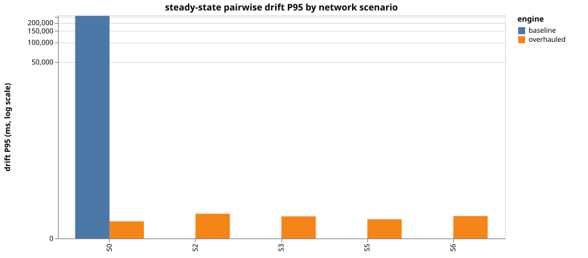
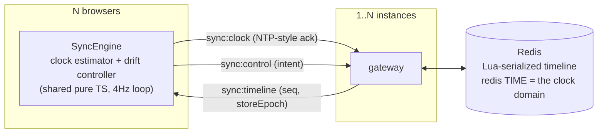

# 🍿 Mustard Watch Party

Watch YouTube together, **measurably in sync**. A watch party is distributed
clock synchronization under variable network conditions — this repo treats it
that way: a server-authoritative timeline, NTP-style clock discipline, a
measured drift controller, and a harness that proves the numbers instead of
claiming them.


## The numbers (measured, not claimed)

Same deterministic 3-browser scenario, same hardware, before → after the
sync overhaul. Every figure traces to a committed run under
[`docs/measurements/`](docs/measurements/) with SHA + hardware provenance.

| scenario (one-way impairment) | baseline P50 / P95 | overhauled P50 / P95 / P99 | convergence after seek |
|---|---|---|---|
| S0 — clean loopback (floor; loopback is unrealistically kind) | 363ms / 255.3s | 31ms / 83ms / 84ms | 0.75s |
| S2 — +150ms each way (~300ms RTT), symmetric | **total failure** (followers never start) | 25ms / 139ms / 140ms | 1.00s |
| S3 — 50±30ms jitter each way | **total failure** (as S2; unrecorded) | 68ms / 118ms / 119ms | 1.00s |
| S5 — 25ms + 5% loss (netem) | **total failure** (as S2; unrecorded) | 60ms / 97ms / 136ms | 0.75s |
| S6 — asymmetric 120ms up / 20ms down | **total failure** (as S2; unrecorded) | 47ms / 120ms / 121ms | 1.00s |

Steady-state hard seeks per minute — S0: 0.00 · S2: 0.00 · S3: 0.00 · S5: 0.25 · S6: 0.00.

3 real Chrome clients, deterministic 240s scenario, Chinmays-MacBook-Pro.local · arm64 · node v20.17.0; runs committed with SHA + scenario + impairment per directory.

Clock-sync theory, validated in vivo: under the asymmetric path (S6) the
clients' own offset estimates carry a **+50.5ms** bias against a **+50.0ms**
prediction (asym/2), with the symmetric control at 0.0ms — the irreducible
NTP-family floor, measured rather than hidden.



The baseline wasn't just slow — **the shipped sync worked only on
localhost**: control events were silently dropped on any real network, a
host seek permanently desynced the room by the full seek distance (255s,
measured), and no correction mechanism existed
([baseline findings](docs/measurements/baseline/README.md)).

Protocol-level, on the production multi-instance plane: 100 clients in one
room hold P95 ≈ 170ms; a 10-cell load sweep (10→250 clients × 1/3 instances)
found **no SLO breach within the load generator's valid range**, with the
trend lines and the extrapolated knee stated honestly
([scaling results](docs/SCALING.md#5-load-characterization)).

## How it works



- **The room's state is a projectable function**, not a scalar:
  `mediaTimeAt(now) = mediaTime + elapsed·rate`, restamped server-side per
  control event with a monotone `seq`. Clients drop stale `(storeEpoch, seq)`.
- **Wait-for-broadcast control**: the button-presser converges from the same
  broadcast as everyone else — echo storms are structurally impossible.
- **Clock discipline**: NTP-style offset over a Socket.IO ack, median-of-
  best-RTT filtering, slew-not-step; validated by bot fleets with injected
  ±1s offsets recovered to ~2ms.
- **SEEK-first correction** (the YouTube API rounds fractional rates toward
  1 — measured, not assumed): corrective seeks target `projected + lead`
  where the lead is *learned* from every seek's settle residual; a per-video
  probe enables rate-nudging only where it actually sticks.
- **Multi-instance**: room timelines live in Redis behind one Lua script per
  mutation (Redis's single-threaded execution is the serializer — no locks),
  with `redis TIME` as the single clock domain (4ms measured spread across
  live instances). Kill -9 an instance mid-playback and the room carries on.

Full design: [docs/SYNC_DESIGN.md](docs/SYNC_DESIGN.md) ·
[docs/SCALING.md](docs/SCALING.md)

## Honest limits

- Embedded-player ads/interstitials can interrupt playback we cannot
  observe; the engine surfaces a click-to-resume chip rather than fighting.
- Path asymmetry biases the clock estimate by asym/2 — fundamental to any
  NTP-family scheme; scenario S6 measures it rather than hiding it.
- Background tabs suspend and resync on focus.
- The load sweep attests up to 250 clients/room on documented hardware; the
  extrapolated single-instance knee (~400–500) is stated as extrapolation.

## Reproduce the numbers

```bash
docker compose -f sync-harness/lab/docker-compose.harness.yml up -d --build
cd sync-harness && npm install && npx playwright install chromium
npm run scenario -- S0          # one 3-browser scenario against your build
npm run bots -- --n 100 --duration 120   # protocol-level, no browsers
```

Methodology — instrument independence, impairment lab (Toxiproxy + tc-netem
in a container), steady-state windows, run validity gates:
[`sync-harness/README.md`](sync-harness/README.md).

## Product

Create a room, share the link, watch together: play/pause/seek stay in
sync, with chat and WebRTC voice. Rooms are public or private with optional
collaborative control; identity is a JWT verified at the socket handshake
(forged control is a [tested rejection](sync-harness/src/verify-m3.ts)).

## Development

Setup, labs, tests and gates: [docs/DEVELOPMENT.md](docs/DEVELOPMENT.md).

## Stack

NestJS · Socket.IO · Prisma/PostgreSQL · Redis (ioredis + Lua) · React ·
a shared pure-TS sync core consumed by the browser, the bot fleet, and jest
· Playwright + Toxiproxy + tc-netem for measurement · GitHub Actions with a
sync-regression gate on every push.
