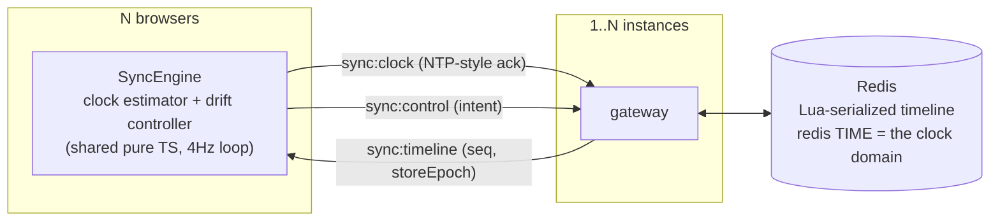

# 🍿 Mustard Watch Party

Watch YouTube together, **measurably in sync**. A watch party is distributed
clock synchronization under variable network conditions — this repo treats it
that way: a server-authoritative timeline, NTP-style clock discipline, a
measured drift controller, and a harness that proves the numbers instead of
claiming them.


*Two real Chrome clients, one room. The left window drives (play, seek,
pause, resume); the right converges from the same `sync:timeline` broadcast
the driver does — wait-for-broadcast, no echo. The overlay is the built-in
debug HUD (`?debug=1`): live drift, clock offset θ, controller state.*

## The numbers (measured, not claimed)

Same deterministic 3-browser scenario, same hardware, before → after the
sync overhaul. Every figure in this table traces to a committed run under
[`docs/measurements/`](docs/measurements/) with SHA + hardware provenance.
(Elsewhere in the docs, figures measured locally but not committed are
tagged **[lab]** — see the provenance convention in
[SYNC_DESIGN.md](docs/SYNC_DESIGN.md).)

| scenario (one-way impairment) | baseline | reactive | **predictive servo (default)** |
|---|---|---|---|
| S0 — clean loopback | 363ms / 255.3s | 31 / 83ms | **16 / 49ms** |
| S2 — +150ms each way (~300ms RTT) | total failure | 25 / 139ms | **19 / 48ms** |
| S3 — 50±30ms jitter each way | aborted† | 68 / 118ms | **23 / 79ms** |
| S5 — 25ms + 5% packet loss | aborted† | 60 / 97ms | **11 / 29ms** |
| S6 — asymmetric 120/20ms | aborted† | 47 / 120ms | **10 / 86ms** |
| S8 — 25ms + 5% TCP-segment dup‡ | not measured | 22 / 30ms | 11 / 139ms |
| S9 — 40ms + 25% reordered-ahead‡ | not measured | 72 / 191ms | **28 / 71ms** |

*Steady-state pairwise drift P50 / P95, 3 real Chrome clients, deterministic
240s scenario, identical hardware. "Total failure" = the shipped engine's
followers never started playing at all, recorded as a committed exhibit run.
Runs: [`docs/measurements/`](docs/measurements/) — baseline, after
(reactive), servo (predictive).*

*‡ S8/S9 are TCP-pathology scenarios: netem's duplicate/reorder act on TCP
segments, which TCP itself dedupes and re-orders — the app never sees a
duplicated or reordered message. They stress dup-ACK processing and
head-of-line blocking (latency variance). The app-level duplicate proof is
the injection harness ([exactly-once artifacts](docs/measurements/exactly-once/)).
One honest wrinkle, single runs each: under S8 the servo's P95 (139ms) is
worse than the reactive arm's (30ms), and under S9 the reactive arm took 17s
to converge after the seek where the servo took 1s — neither is averaged
away.*

*† The baseline engine failed the harness player-health gate on both attempts
under S3/S5/S6 — same signature as S2, followers never started — so the run
aborted and no artifact exists to cite. Only S0 and S2 have committed
baseline directories. These cells say "aborted" rather than "total failure"
because an observation that produced no artifact is not a measurement, and
this table cites only what you can open.*

**Validated against the signal, not the clock.** Player-API drift is the
instrument grading itself, so a separate track measures the *physical* output:
three browsers play a click track, an AudioWorklet timestamps each burst on the
audio thread, and the same click is differenced across clients. Truth: **P50
13.2ms / P95 64.0ms** where the player API claimed 7.9 / 19.0ms — the API-based
numbers are **optimistic by ~45ms at P95**, and that gap is now measured rather
than assumed ([docs/AUDIO_TRUTH.md](docs/AUDIO_TRUTH.md)).

Clock-sync theory, validated in vivo: under the asymmetric path (S6) the
clients' own offset estimates carry a **+50.5ms** bias against a **+50.0ms**
prediction (asym/2), with the symmetric control at 0.0ms — the irreducible
NTP-family floor, measured rather than hidden.


The baseline wasn't just slow — **the shipped sync worked only on
localhost**: control events were silently dropped on any real network, a
host seek permanently desynced the room by the full seek distance (255s,
measured), and no correction mechanism existed
([baseline findings](docs/measurements/baseline/README.md)).

Protocol-level, on the production multi-instance plane: 100 clients in one
room hold P95 149ms (P50 70ms); a 10-cell load sweep (10→250 clients × 1/3
instances) finds **no SLO breach up to 250 clients in one room on either
topology**, with zero seq gaps or reorders on every cell. An earlier sweep
had measured a one-instance event-loop-lag knee at 250 (130ms); a controlled
re-run did not reproduce it (42ms), so the knee is above 250 and honestly
*unlocated* — both runs are committed
([scaling results](docs/SCALING.md#5-load-characterization)).

### Every source, same sync

The sync core is player-agnostic — one classifier
(`shared/media-source.ts`) decides which player mounts, one adapter
surface drives them all — and that claim is measured per source, not
asserted. Same 3-browser scenario, same hardware, same engine; the
YouTube column is the main table above:

| source → player | S0 clean | S2 (~300ms RTT) |
|---|---|---|
| YouTube → IFrame API | 16 / 49ms | 19 / 48ms |
| direct file → `<video>` | **6 / 27ms** | **6 / 18ms** |
| HLS → hls.js (MSE) | **5 / 19ms** | **7 / 18ms** |
| Vimeo → Player SDK | **8 / 38ms** | not measured |

*Steady-state pairwise drift P50 / P95; runs committed under
[`docs/measurements/sources/`](docs/measurements/sources/), each stamped
with the URL measured and the classifier's verdict. The native arms sync
tighter than YouTube because a same-origin element reports a genuine
`currentTime` — no postMessage quantization to reconstruct around.
Vimeo's promise-only SDK is modeled locally from ~4Hz `timeupdate` edges;
the noisier readout costs ~1.5 corrective seeks/min at S0 where the
native arms take none. Honest scope: one scenario each (two for
file/HLS), and the first attempt at the file arm was discarded and
re-run — a cold-launched browser stalled all three pages past the socket
ping deadline, the emptied room re-initialized paused (by design, P5),
and the "measurement" was of the room being paused; the committed runs
gate on ≥2,000 steady samples, which is what caught it.*

## How it works



- **The room's state is a projectable function**, not a scalar:
  `mediaTimeAt(now) = mediaTime + elapsed·rate`, restamped server-side per
  control event with a monotone `seq`. Clients drop stale `(storeEpoch, seq)`.
- **Wait-for-broadcast control**: the button-presser converges from the same
  broadcast as everyone else — echo storms are structurally impossible.
- **Exactly-once control commands**: client-minted idempotency keys, deduped
  atomically inside the same Lua script as the commit (Stripe's model), with
  the design model-checked first — `formal/SyncExactlyOnce.tla` proves
  at-most-once application under duplication and reordering, and three
  committed must-fail configs pin why the dedup must be atomic, why the TTL
  is a correctness parameter, and why sweep commits must be logged. Proven
  live by injection: duplicates sent with the same key produce **zero extra
  commits** across all three conforming implementations (below)
  ([artifacts](docs/measurements/exactly-once/)).
- **Append-only command log + replay reconciliation**: every commit also
  appends to a per-room stream in the same atomic step; a reconciler checks
  every retained transition against an independently-written legal-transition
  contract and compares the newest entry to live state — **measured drift
  rate: 0**, gated nightly over real fleet traffic.
- **Clock discipline**: NTP-style offset over a Socket.IO ack, median-of-
  best-RTT filtering, slew-not-step; validated by bot fleets with injected
  ±1s offsets and ±80ppm skews, recovered to a θ-error P95 of ~3ms
  (2.7–6.9ms across the committed 10→250-client sweep).
- **Predictive clock discipline** (default): a PI servo with an RLS-learned
  feed-forward skew term commands a continuous playback rate that cancels
  drift *before* it accumulates. It is engaged per video by a runtime probe;
  where the player refuses fractional rates the engine falls back to a
  SEEK-first controller whose corrective seeks target `projected + lead`,
  with the lead *learned* from each seek's settle residual.
- **Multi-instance**: room timelines live in Redis behind one Lua script per
  mutation (Redis's single-threaded execution is the serializer — no locks),
  with `redis TIME` as the single clock domain (4ms spread measured across
  live instances by `verify-m6.ts`; console-gated, not a committed run). Kill -9 an instance mid-playback and the room carries on.

Full design: [docs/SYNC_DESIGN.md](docs/SYNC_DESIGN.md) ·
[scaling & coordination](docs/SCALING.md) · [two coordination planes, measured](docs/COORDINATION.md) ·
[formal verification](docs/FORMAL.md) · [audio ground truth](docs/AUDIO_TRUTH.md) ·
[Go relay](docs/RELAY.md) · [Rust relay + load study](relay-rs/README.md)

## Identity & sessions

The same JWT (`{sub, name, jti, ver, sess, exp}`, HS256) authenticates every
REST call and the socket handshake — one contract in
[`token-payload.ts`](video-sync-backend/src/auth/token-payload.ts) that the
REST guard, the WS middleware, and the Go/Rust relays all read the same way.
The design goal was that neither the request path nor the handshake does a
database lookup, and the security features below are built to keep that true.

- **Revocation that reaches a live connection.** `logout` and `logout-all`
  don't just drop the client's token — they take it out of circulation and
  **close the socket it already opened**, with a reason the client shows
  (`session-ended`). A per-request check reads an in-memory snapshot (no IO);
  Postgres is the durable truth, Redis carries the news to other instances,
  and the honest worst-case staleness is 30s, not the token's 12h lifetime.
- **Sliding sessions that can't be abused.** `refresh` rotates the `jti` and
  revokes the old token in the same call — so a stolen copy is worth *less*
  after a refresh, not more — bounded by a 30-day absolute cap anchored to the
  session's birth (`sess`), which refreshes preserve. Concurrent multi-tab
  refresh is tolerated; genuine token reuse is caught by the durable jti check.
- **Google sign-in** is a server-side authorization-code flow with PKCE and an
  HMAC-sealed state cookie (login-CSRF/PKCE defense); the token comes back in
  the URL **fragment**, never the query string. Guests get a real row and can
  **claim it in place** (password or Google) keeping their chat and
  participant history under the same id. Setting a password re-authenticates
  first and signs out every other session atomically.
- **Every one of these is proven by a live check against a real server + Redis**,
  not just unit tests — the revocation, session, claim, and rate-limit scripts
  in [`scripts/live-checks/`](scripts/live-checks/) — because this surface has
  a history of unit-correct code that reached nobody in production.

Full model, and the design decisions behind each: [docs/AUTH.md](docs/AUTH.md)
· [guest access](docs/GUEST_ACCESS.md).

## Three conforming implementations of the sync plane

The protocol is defined by TLA+ specs and enforced by Redis Lua scripts that
are **language-agnostic on purpose** — so the same bot fleet can prove any
implementation byte-for-byte. There are three:

| plane | language / transport | role |
|---|---|---|
| **Node** (`video-sync-backend`) | NestJS / Socket.IO+JSON | production — auth, rooms, chat, voice, sync |
| **relay-go** ([`relay-go/`](relay-go/)) | Go / raw-WS binary | conformance study + systems benchmark |
| **relay-rs** ([`relay-rs/`](relay-rs/)) | Rust / raw-WS binary | third conformance target + runtime study |

The Go and Rust relays run the *same* Lua against the *same* Redis and speak
a byte-identical binary protocol; each passes the identical gated bot fleet
and the plane-agnostic revocation/ingress live checks. Two independent
implementations that must agree on every byte catch spec-vs-code bugs a single
one can't — and a third, GC-free, stresses the spec from an angle neither GC'd
plane does.

The runtime study answered a question the drift numbers structurally can't
(drift is bounded by protocol + network, not the runtime, which is why Go and
Rust *tie* Node on sync quality). At **10,000 concurrent connections** the
clean result is **memory**: Rust held ~15 KB/connection vs Go's ~40 KB (a
reproducible ~3×), at ~a fifth the CPU. Latency showed a modest, consistent
Rust edge at median/p95; the *extreme* tail was too noisy on a single
co-resident machine to attribute cleanly, and the write-up
[says so rather than citing the best-looking run](relay-rs/README.md#the-evaluation-the-drift-numbers-could-not-do).
Neither relay is deployed — they are studies and conformance targets, not
production services. A roadmap for migrating the production backend to Rust,
built as a conformance-gated strangler-fig on top of this machinery, is in
[docs/RUST_MIGRATION.md](docs/RUST_MIGRATION.md).

## Honest limits

- Embedded-player ads/interstitials can interrupt playback we cannot
  observe; the engine surfaces a click-to-resume chip rather than fighting.
- Path asymmetry biases the clock estimate by asym/2 — fundamental to any
  NTP-family scheme; scenario S6 measures it rather than hiding it.
- Background tabs suspend and resync on focus.
- Capacity is measured, not extrapolated: **no SLO breach up to 250 clients
  in one room** on either topology in the current sweep. An earlier sweep
  measured a single-instance lag breach at 250 that a controlled re-run did
  not reproduce — both runs are committed, the attribution is withdrawn, and
  the knee is above 250 and unlocated. Beyond 250/room is untested.

## Reproduce the numbers

```bash
docker compose -f sync-harness/lab/docker-compose.harness.yml up -d --build
cd sync-harness && npm install && npx playwright install chromium
npm run scenario -- S0          # one 3-browser scenario against your build
HARNESS_VIDEO_URL=/media/hls/clicktrack.m3u8 npm run scenario -- S0   # another source arm
npm run bots -- --n 100 --duration 120   # protocol-level, no browsers
```

Methodology — instrument independence, impairment lab (Toxiproxy + tc-netem
in a container), steady-state windows, run validity gates:
[`sync-harness/README.md`](sync-harness/README.md).

## Product

Create a room, share the link, watch together: play/pause/seek stay in
sync, with chat and WebRTC voice. Rooms are public or private with optional
collaborative control. Sign in with a password or Google, or join as a guest
and keep the account later — identity is a JWT verified at both the REST guard
and the socket handshake (forged control is a
[tested rejection](sync-harness/src/verify-m3.ts)), with revocation, sliding
sessions, and account management (see [Identity & sessions](#identity--sessions)).

## Development

Setup, labs, tests and gates: [docs/DEVELOPMENT.md](docs/DEVELOPMENT.md).

## Stack

NestJS · Socket.IO · Prisma/PostgreSQL · Redis (ioredis + Lua) · React ·
JWT auth with Google OAuth (PKCE) and token revocation · a shared pure-TS
sync core consumed by the browser, the bot fleet, and jest · two additional
conforming sync implementations in Go and Rust · Playwright + Toxiproxy +
tc-netem for measurement · TLA+ (TLC) model-checking nightly · GitHub Actions
with a sync-regression gate on every pull request and every push to `main`.
