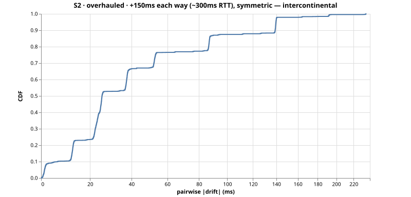
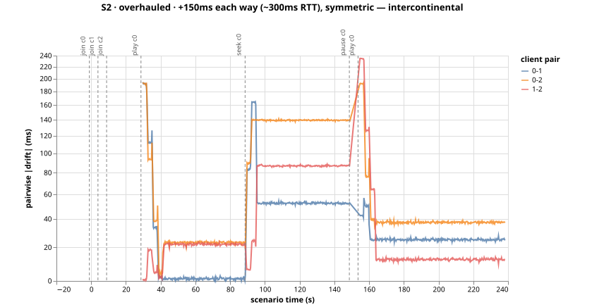
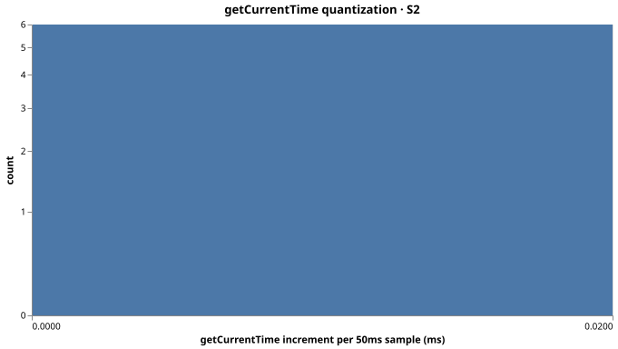

# Run S2-overhauled-msdfw6s2 — S2 (overhauled)

+150ms each way (~300ms RTT), symmetric — intercontinental

- git SHA: `57b730a8610d96f23b248a2286f27ef4ced167e6`
- started: 2026-08-03T16:24:32.271Z
- clients: 3 · video: `aqz-KE-bpKQ` · ws: `ws://localhost:3101`
- hardware: Chinmays-MacBook-Pro.local · arm64 · node v20.17.0

## Pairwise |drift| (steady-state windows)

| P50 | P95 | P99 | max | samples |
|-----|-----|-----|-----|---------|
| 25ms | 139ms | 140ms | 165ms | 2239 |

All-time (incl. warmup + post-control): P50 25ms, P95 140ms, P99 192ms.

Hard seeks/minute: 0.00

## Convergence after control events

- join@c0: 33.75s
- join@c1: 29.00s
- join@c2: 24.00s
- play@c0: 4.25s
- seek@c0: 1.00s
- play@c0: 4.25s

## getCurrentTime noise floor

Plateau length P50/P95: NaNms / NaNms.
Per-50ms increment P50/P95: 0.0ms / 0.0ms.

