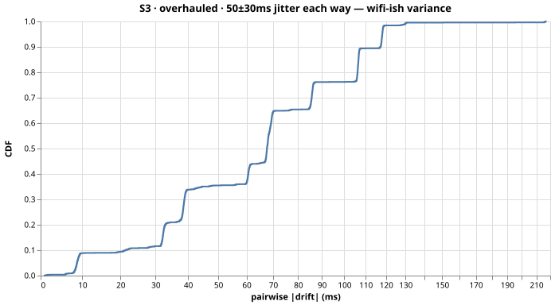
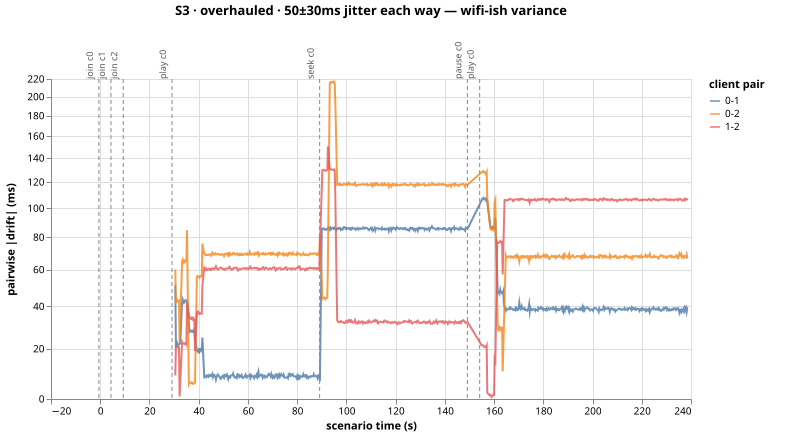

# Run S3-overhauled-msdg1cko — S3 (overhauled)

50±30ms jitter each way — wifi-ish variance

- git SHA: `57b730a8610d96f23b248a2286f27ef4ced167e6`
- started: 2026-08-03T16:28:33.046Z
- clients: 3 · video: `aqz-KE-bpKQ` · ws: `ws://localhost:3101`
- hardware: Chinmays-MacBook-Pro.local · arm64 · node v20.17.0

## Pairwise |drift| (steady-state windows)

| P50 | P95 | P99 | max | samples |
|-----|-----|-----|-----|---------|
| 68ms | 118ms | 119ms | 217ms | 2239 |

All-time (incl. warmup + post-control): P50 68ms, P95 118ms, P99 130ms.

Hard seeks/minute: 0.00

## Convergence after control events

- join@c0: 31.00s
- join@c1: 26.25s
- join@c2: 21.25s
- play@c0: 1.25s
- seek@c0: 1.00s
- play@c0: 1.00s

## getCurrentTime noise floor

Plateau length P50/P95: NaNms / NaNms.
Per-50ms increment P50/P95: NaNms / NaNms.

