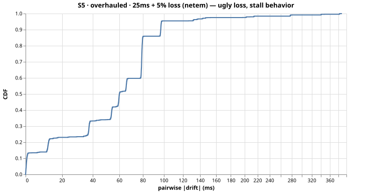
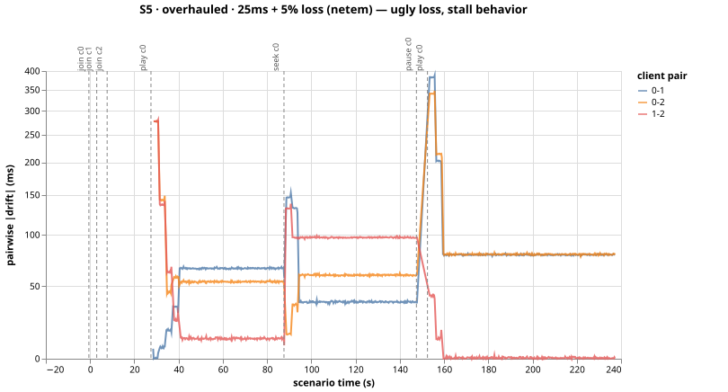

# Run S5-overhauled-msdffpwe — S5 (overhauled)

25ms + 5% loss (netem) — ugly loss, stall behavior

- git SHA: `d7eead284ac481053cbb20fe113cbe489dbbbb49`
- started: 2026-08-03T16:11:44.083Z
- clients: 3 · video: `aqz-KE-bpKQ` · ws: `ws://localhost:3102`
- hardware: Chinmays-MacBook-Pro.local · arm64 · node v20.17.0

## Pairwise |drift| (steady-state windows)

| P50 | P95 | P99 | max | samples |
|-----|-----|-----|-----|---------|
| 60ms | 97ms | 136ms | 215ms | 2243 |

All-time (incl. warmup + post-control): P50 60ms, P95 98ms, P99 278ms.

Hard seeks/minute: 0.25

## Convergence after control events

- join@c0: 32.00s
- join@c1: 28.25s
- join@c2: 23.75s
- play@c0: 3.75s
- seek@c0: 0.75s
- play@c0: 7.00s

## getCurrentTime noise floor

Plateau length P50/P95: NaNms / NaNms.
Per-50ms increment P50/P95: NaNms / NaNms.

