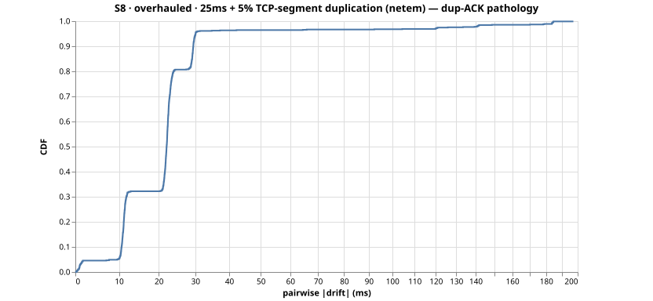
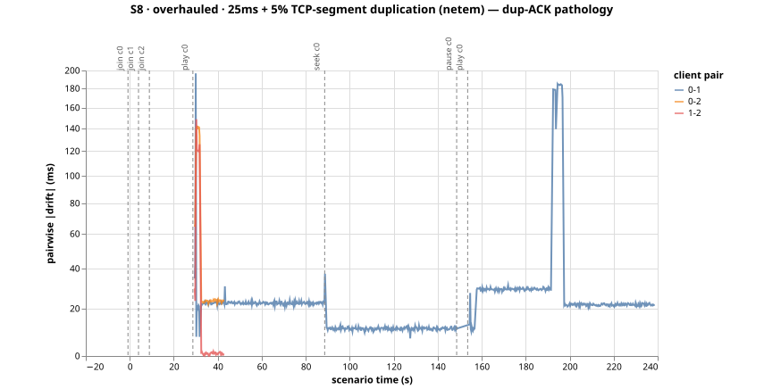

# Run S8-overhauled-reactive-msi9x1kp — S8 (overhauled)

25ms + 5% TCP-segment duplication (netem) — dup-ACK pathology

- git SHA: `2e4034c0b74c43044a0a68e2aefc564a2200e5f1`
- started: 2026-08-07T01:36:05.915Z
- clients: 3 · video: `aqz-KE-bpKQ` · ws: `ws://localhost:3102`
- hardware: Chinmays-MacBook-Pro.local · arm64 · node v20.17.0

## Pairwise |drift| (steady-state windows)

| P50 | P95 | P99 | max | samples |
|-----|-----|-----|-----|---------|
| 22ms | 30ms | 183ms | 185ms | 824 |

All-time (incl. warmup + post-control): P50 22ms, P95 30ms, P99 183ms.

Hard seeks/minute: 0.00

## Convergence after control events

- join@c0: 30.25s
- join@c1: 26.50s
- join@c2: 20.50s
- play@c0: 0.75s
- seek@c0: 0.75s
- play@c0: 0.75s

## getCurrentTime noise floor

Plateau length P50/P95: NaNms / NaNms.
Per-50ms increment P50/P95: NaNms / NaNms.

