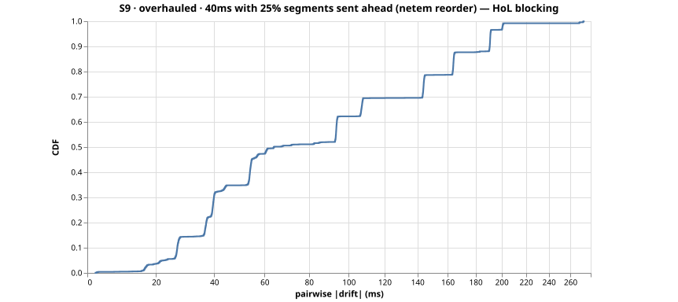
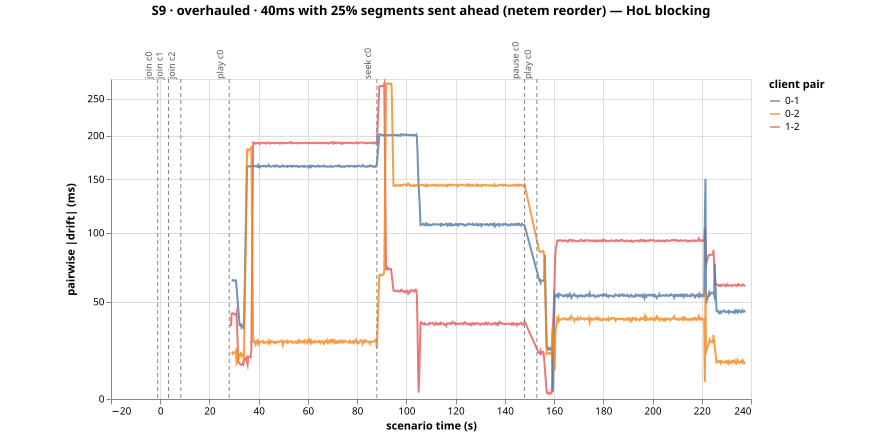
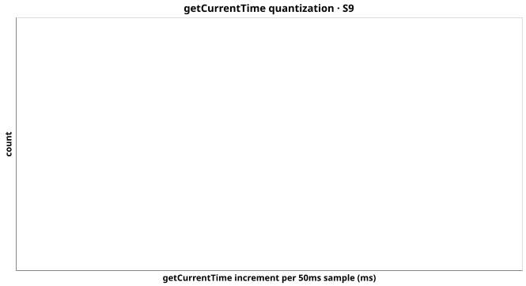

# Run S9-overhauled-reactive-msia27xr — S9 (overhauled)

40ms with 25% segments sent ahead (netem reorder) — HoL blocking

- git SHA: `2e4034c0b74c43044a0a68e2aefc564a2200e5f1`
- started: 2026-08-07T01:40:06.933Z
- clients: 3 · video: `aqz-KE-bpKQ` · ws: `ws://localhost:3102`
- hardware: Chinmays-MacBook-Pro.local · arm64 · node v20.17.0

## Pairwise |drift| (steady-state windows)

| P50 | P95 | P99 | max | samples |
|-----|-----|-----|-----|---------|
| 72ms | 191ms | 201ms | 273ms | 2236 |

All-time (incl. warmup + post-control): P50 64ms, P95 191ms, P99 201ms.

Hard seeks/minute: 0.00

## Convergence after control events

- join@c0: 29.75s
- join@c1: 25.50s
- join@c2: 20.50s
- play@c0: 0.75s
- seek@c0: 17.00s
- play@c0: 0.75s

## getCurrentTime noise floor

Plateau length P50/P95: NaNms / NaNms.
Per-50ms increment P50/P95: NaNms / NaNms.

