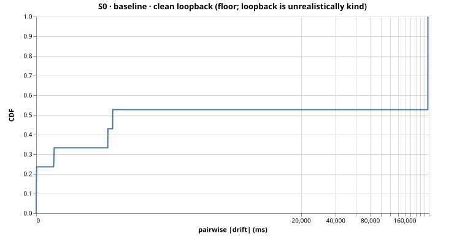
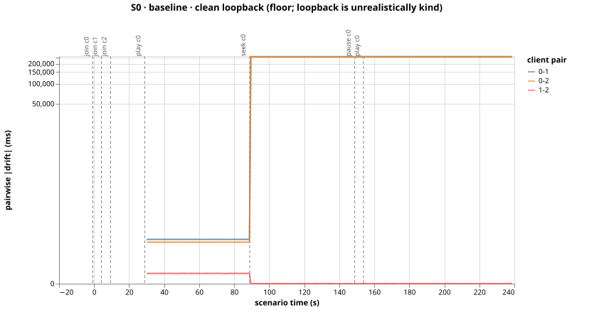
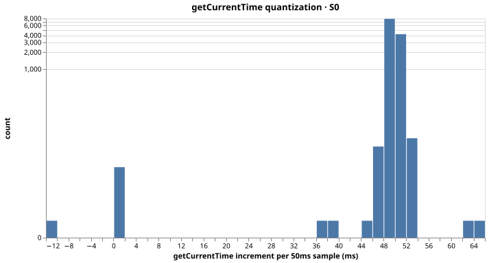

# Run S0-baseline-mscjatn1 — S0 (baseline)

clean loopback (floor; loopback is unrealistically kind)

- git SHA: `a55e81c34fb8b47e9392adff168ee3a2e48c181e`
- started: 2026-08-03T01:12:07.811Z
- clients: 3 · video: `aqz-KE-bpKQ` · ws: `ws://localhost:3000`
- hardware: Chinmays-MacBook-Pro.local · arm64 · node v20.17.0

## Pairwise |drift| (steady-state windows)

| P50 | P95 | P99 | max | samples |
|-----|-----|-----|-----|---------|
| 363ms | 255269ms | 255270ms | 255271ms | 2280 |

All-time (incl. warmup + post-control): P50 363ms, P95 255269ms, P99 255270ms.

Hard seeks/minute: 0.00

## Convergence after control events

- join@c0: never converged (< 150ms for 3 grid points)
- join@c1: never converged (< 150ms for 3 grid points)
- join@c2: never converged (< 150ms for 3 grid points)
- play@c0: never converged (< 150ms for 3 grid points)
- seek@c0: never converged (< 150ms for 3 grid points)
- play@c0: never converged (< 150ms for 3 grid points)

## getCurrentTime noise floor

Plateau length P50/P95: 50ms / 51ms.
Per-50ms increment P50/P95: 50.0ms / 51.0ms.

