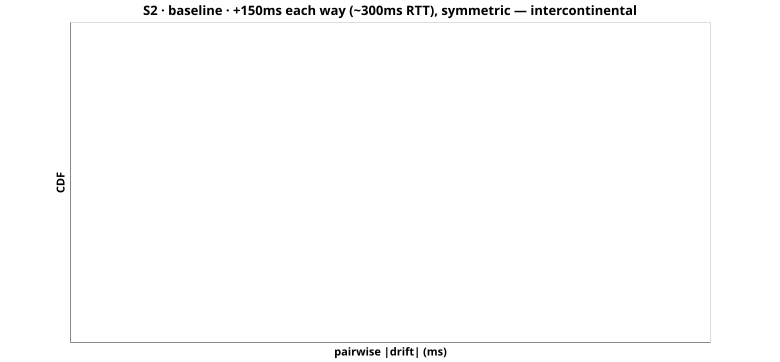
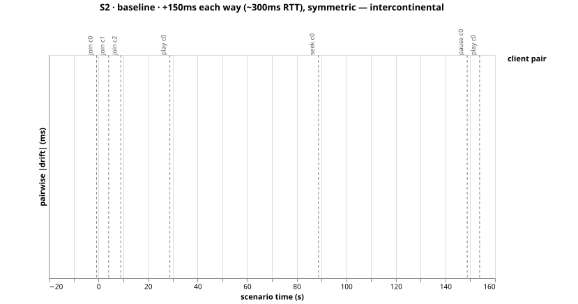
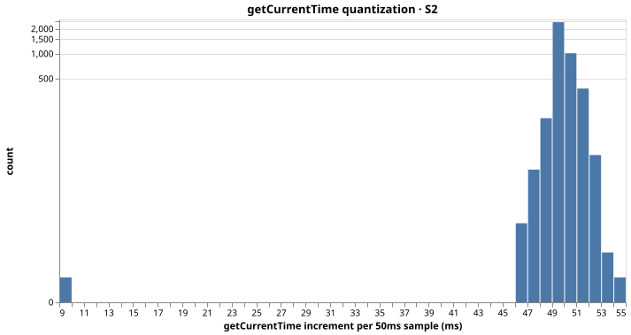

# Run S2-baseline-mscjtbgk — S2 (baseline)

+150ms each way (~300ms RTT), symmetric — intercontinental

- git SHA: `a55e81c34fb8b47e9392adff168ee3a2e48c181e`
- started: 2026-08-03T01:26:30.727Z
- clients: 3 · video: `aqz-KE-bpKQ` · ws: `ws://localhost:3101`
- hardware: Chinmays-MacBook-Pro.local · arm64 · node v20.17.0

## Pairwise |drift| (steady-state windows)

| P50 | P95 | P99 | max | samples |
|-----|-----|-----|-----|---------|
| n/a | n/a | n/a | n/a | 0 |

All-time (incl. warmup + post-control): P50 n/a, P95 n/a, P99 n/a.

Hard seeks/minute: 0.00

## Convergence after control events

- join@c0: never converged (< 150ms for 3 grid points)
- join@c1: never converged (< 150ms for 3 grid points)
- join@c2: never converged (< 150ms for 3 grid points)
- play@c0: never converged (< 150ms for 3 grid points)
- seek@c0: never converged (< 150ms for 3 grid points)
- play@c0: never converged (< 150ms for 3 grid points)

## getCurrentTime noise floor

Plateau length P50/P95: NaNms / NaNms.
Per-50ms increment P50/P95: 50.0ms / 51.0ms.

