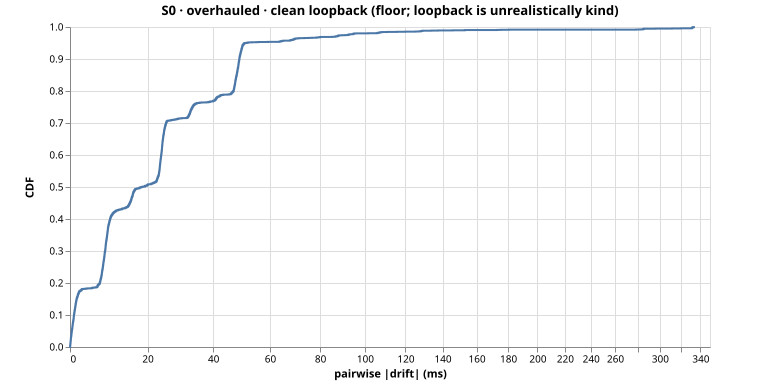
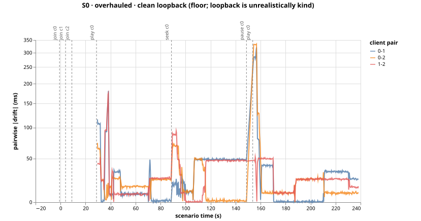

# Run S0-overhauled-servo-mse71bxi — S0 (overhauled)

clean loopback (floor; loopback is unrealistically kind)

- git SHA: `84ab38682e94412769079df12db686f3f5308a57`
- started: 2026-08-04T05:04:22.046Z
- clients: 3 · video: `aqz-KE-bpKQ` · ws: `ws://localhost:3000`
- hardware: Chinmays-MacBook-Pro.local · arm64 · node v20.17.0

## Pairwise |drift| (steady-state windows)

| P50 | P95 | P99 | max | samples |
|-----|-----|-----|-----|---------|
| 16ms | 49ms | 92ms | 181ms | 2264 |

All-time (incl. warmup + post-control): P50 18ms, P95 51ms, P99 153ms.

Hard seeks/minute: 0.00

## Convergence after control events

- join@c0: 30.25s
- join@c1: 25.50s
- join@c2: 20.50s
- play@c0: 0.75s
- seek@c0: 0.75s
- play@c0: 3.25s

## getCurrentTime noise floor

Plateau length P50/P95: NaNms / NaNms.
Per-50ms increment P50/P95: NaNms / NaNms.

