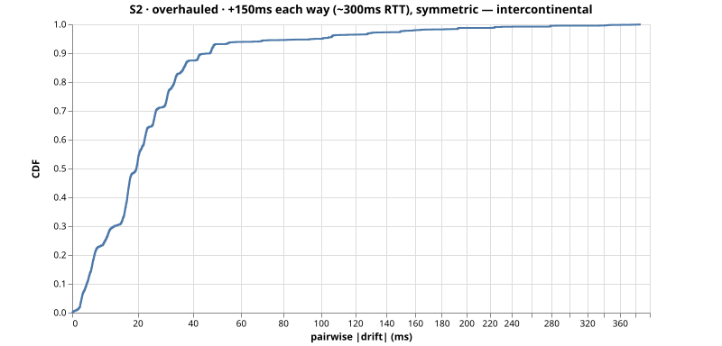
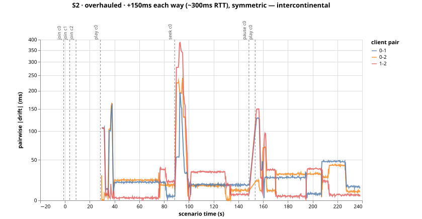

# Run S2-overhauled-servo-mse76wbj — S2 (overhauled)

+150ms each way (~300ms RTT), symmetric — intercontinental

- git SHA: `84ab38682e94412769079df12db686f3f5308a57`
- started: 2026-08-04T05:08:41.620Z
- clients: 3 · video: `aqz-KE-bpKQ` · ws: `ws://localhost:3101`
- hardware: Chinmays-MacBook-Pro.local · arm64 · node v20.17.0

## Pairwise |drift| (steady-state windows)

| P50 | P95 | P99 | max | samples |
|-----|-----|-----|-----|---------|
| 19ms | 48ms | 158ms | 349ms | 2262 |

All-time (incl. warmup + post-control): P50 20ms, P95 100ms, P99 225ms.

Hard seeks/minute: 0.00

## Convergence after control events

- join@c0: 30.75s
- join@c1: 25.75s
- join@c2: 20.75s
- play@c0: 1.00s
- seek@c0: 8.75s
- play@c0: 1.00s

## getCurrentTime noise floor

Plateau length P50/P95: NaNms / NaNms.
Per-50ms increment P50/P95: NaNms / NaNms.

