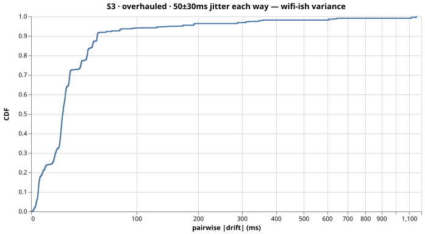
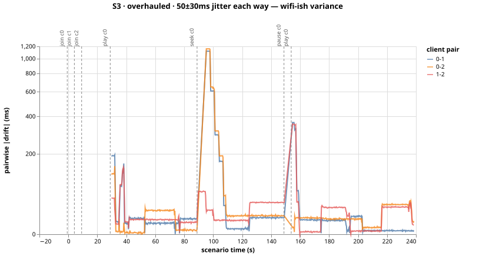
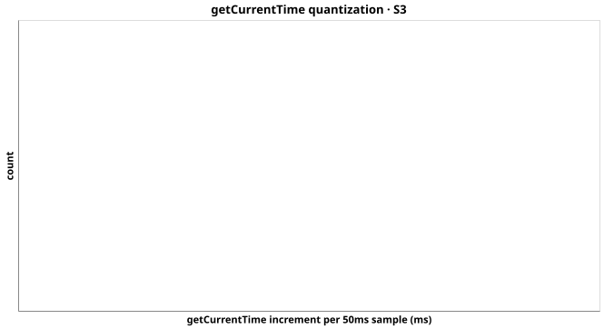

# Run S3-overhauled-servo-mse7c27y — S3 (overhauled)

50±30ms jitter each way — wifi-ish variance

- git SHA: `84ab38682e94412769079df12db686f3f5308a57`
- started: 2026-08-04T05:12:42.466Z
- clients: 3 · video: `aqz-KE-bpKQ` · ws: `ws://localhost:3101`
- hardware: Chinmays-MacBook-Pro.local · arm64 · node v20.17.0

## Pairwise |drift| (steady-state windows)

| P50 | P95 | P99 | max | samples |
|-----|-----|-----|-----|---------|
| 23ms | 79ms | 647ms | 1158ms | 2251 |

All-time (incl. warmup + post-control): P50 23ms, P95 163ms, P99 647ms.

Hard seeks/minute: 0.00

## Convergence after control events

- join@c0: 33.50s
- join@c1: 28.75s
- join@c2: 23.75s
- play@c0: 4.00s
- seek@c0: 1.00s
- play@c0: 3.50s

## getCurrentTime noise floor

Plateau length P50/P95: NaNms / NaNms.
Per-50ms increment P50/P95: NaNms / NaNms.

