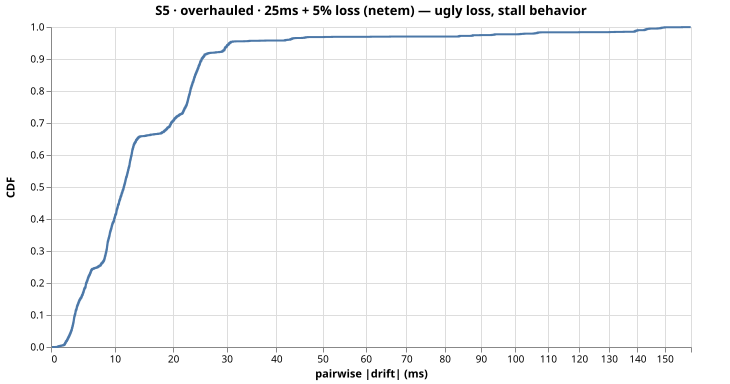
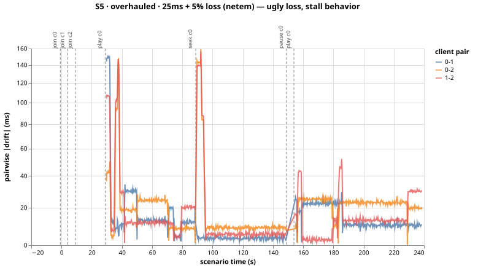
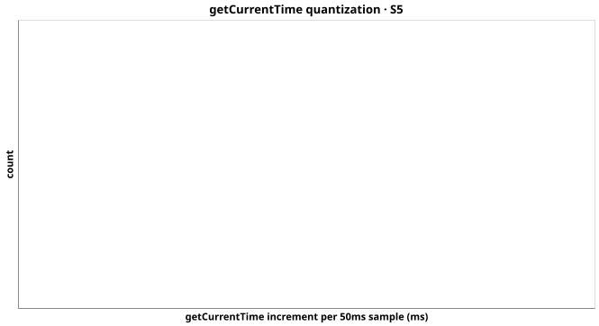

# Run S5-overhauled-servo-mse7h7zp — S5 (overhauled)

25ms + 5% loss (netem) — ugly loss, stall behavior

- git SHA: `84ab38682e94412769079df12db686f3f5308a57`
- started: 2026-08-04T05:16:43.547Z
- clients: 3 · video: `aqz-KE-bpKQ` · ws: `ws://localhost:3102`
- hardware: Chinmays-MacBook-Pro.local · arm64 · node v20.17.0

## Pairwise |drift| (steady-state windows)

| P50 | P95 | P99 | max | samples |
|-----|-----|-----|-----|---------|
| 11ms | 29ms | 66ms | 148ms | 2269 |

All-time (incl. warmup + post-control): P50 11ms, P95 31ms, P99 140ms.

Hard seeks/minute: 0.00

## Convergence after control events

- join@c0: 30.50s
- join@c1: 25.50s
- join@c2: 20.50s
- play@c0: 0.75s
- seek@c0: 0.75s
- play@c0: 0.75s

## getCurrentTime noise floor

Plateau length P50/P95: NaNms / NaNms.
Per-50ms increment P50/P95: NaNms / NaNms.

