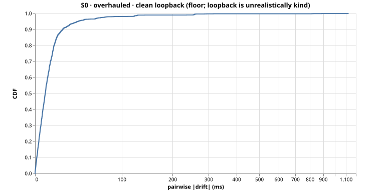
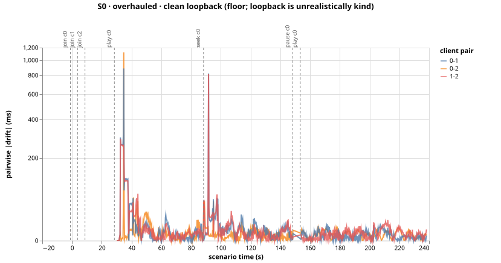

# Run S0-overhauled-msjpgb9o — S0 (overhauled)

clean loopback (floor; loopback is unrealistically kind)

- git SHA: `c2ffbdf1f1e751d7d599f16771f3bd0edc37aa8a`
- started: 2026-08-08T01:38:45.287Z
- clients: 3 · video: `1084537` (vimeo) · ws: `ws://localhost:3000`
- hardware: Chinmays-MacBook-Pro.local · arm64 · node v20.17.0

## Pairwise |drift| (steady-state windows)

| P50 | P95 | P99 | max | samples |
|-----|-----|-----|-----|---------|
| 8ms | 38ms | 125ms | 1122ms | 2280 |

All-time (incl. warmup + post-control): P50 8ms, P95 40ms, P99 128ms.

Hard seeks/minute: 1.51

## Convergence after control events

- join@c0: 31.00s
- join@c1: 26.25s
- join@c2: 21.25s
- play@c0: 1.50s
- seek@c0: 0.00s
- play@c0: 0.50s

## getCurrentTime noise floor

Plateau length P50/P95: n/a / n/a.
Per-50ms increment P50/P95: n/a / n/a.

