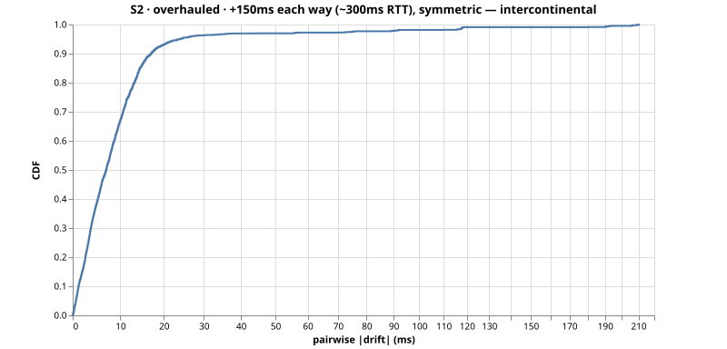
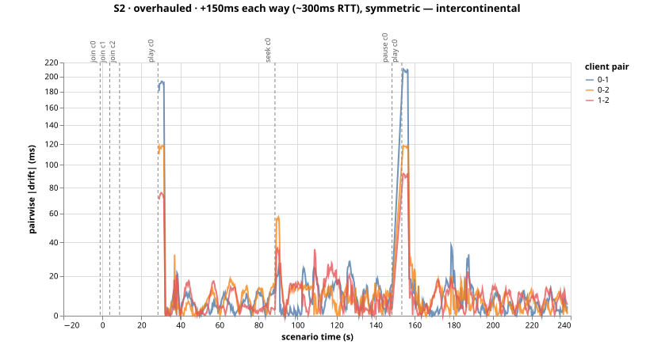

# Run S2-overhauled-msjpaix6 — S2 (overhauled)

+150ms each way (~300ms RTT), symmetric — intercontinental

- git SHA: `c2ffbdf1f1e751d7d599f16771f3bd0edc37aa8a`
- started: 2026-08-08T01:34:14.664Z
- clients: 3 · video: `/media/hls/clicktrack.m3u8` (hls) · ws: `ws://localhost:3101`
- hardware: Chinmays-MacBook-Pro.local · arm64 · node v20.17.0

## Pairwise |drift| (steady-state windows)

| P50 | P95 | P99 | max | samples |
|-----|-----|-----|-----|---------|
| 7ms | 18ms | 25ms | 38ms | 2273 |

All-time (incl. warmup + post-control): P50 7ms, P95 24ms, P99 118ms.

Hard seeks/minute: 0.00

## Convergence after control events

- join@c0: 33.50s
- join@c1: 28.50s
- join@c2: 23.50s
- play@c0: 3.75s
- seek@c0: 0.75s
- play@c0: 4.00s

## getCurrentTime noise floor

Plateau length P50/P95: n/a / n/a.
Per-50ms increment P50/P95: n/a / n/a.

