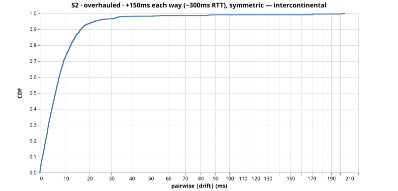
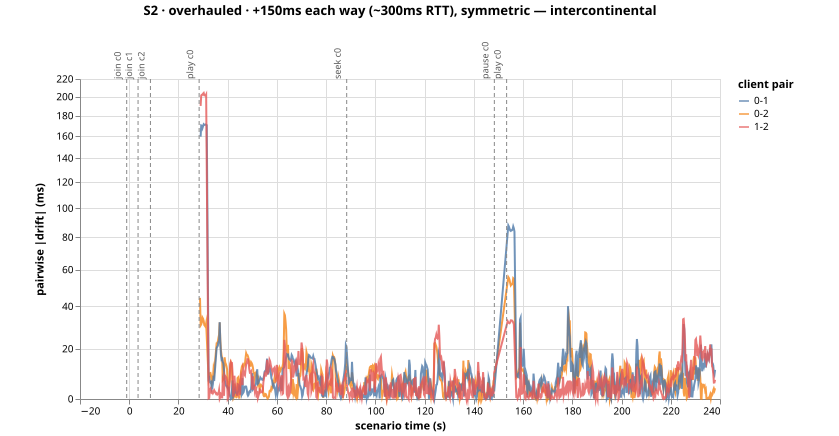
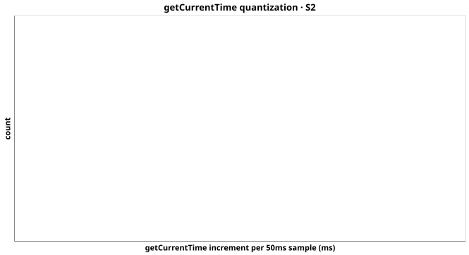

# Run S2-overhauled-msjpmaci — S2 (overhauled)

+150ms each way (~300ms RTT), symmetric — intercontinental

- git SHA: `c2ffbdf1f1e751d7d599f16771f3bd0edc37aa8a`
- started: 2026-08-08T01:43:24.154Z
- clients: 3 · video: `/media/clicktrack.mp4` (file) · ws: `ws://localhost:3101`
- hardware: Chinmays-MacBook-Pro.local · arm64 · node v20.17.0

## Pairwise |drift| (steady-state windows)

| P50 | P95 | P99 | max | samples |
|-----|-----|-----|-----|---------|
| 6ms | 18ms | 27ms | 40ms | 2269 |

All-time (incl. warmup + post-control): P50 6ms, P95 22ms, P99 86ms.

Hard seeks/minute: 0.00

## Convergence after control events

- join@c0: 33.25s
- join@c1: 28.50s
- join@c2: 23.50s
- play@c0: 3.75s
- seek@c0: 0.75s
- play@c0: 0.50s

## getCurrentTime noise floor

Plateau length P50/P95: n/a / n/a.
Per-50ms increment P50/P95: n/a / n/a.

